# ASDT-Harjoitukset-2
Toinen osa Advanced Software Development Techniques -kurssin tehtävistä

## Tehdyt Tehtävät
### PERUSASIAT (8p) 1-4

#### Tehtävä 1
Tavoite:
- Toteuta rinnakkainen ohjelma, jossa rotat (lapsiprosessit) liikkuvat itsenäisesti labyrintissa.
- Pääprosessi (parent) odottaa kaikkien rottien saavuttavan suuaukon.
- Kun kaikki ovat perillä, ohjelma poistuu.

Testattavat asiat:
- Useiden prosessien rinnakkainen käsittely.
- Yksinkertainen jaetun muistin käyttö prosessien välisessä tiedonvälityksessä.
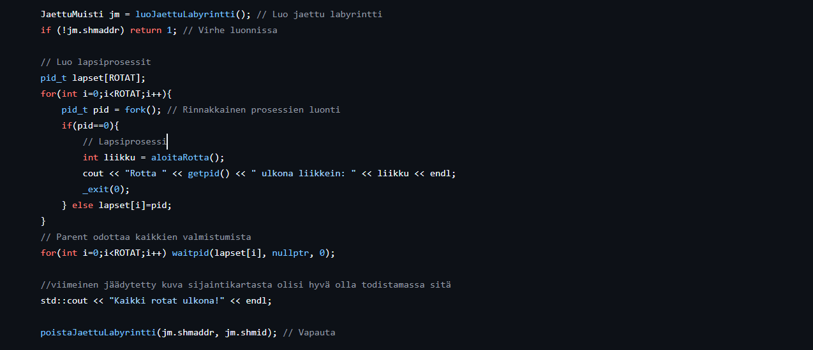
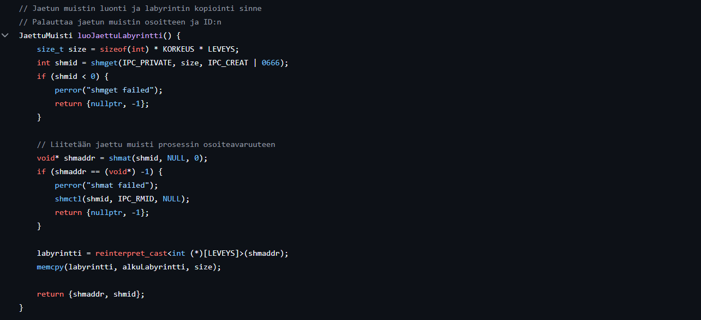
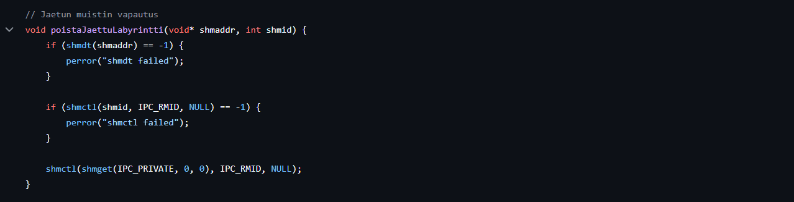
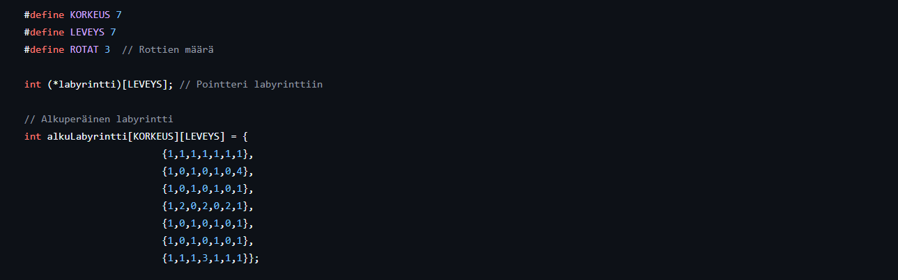

#### Tehtävä 2
Tavoite:
- Toteuta ohjelma, jossa rotat (säikeet) liikkuvat itsenäisesti labyrintissa.
- Main-säie odottaa kaikkien säikeiden valmistumista (rottien pääsy suuaukolle).
- Kun kaikki ovat valmiit, ohjelma poistuu.

Testattavat asiat:
- Useiden säikeiden rinnakkainen käsittely samassa ohjelmassa.
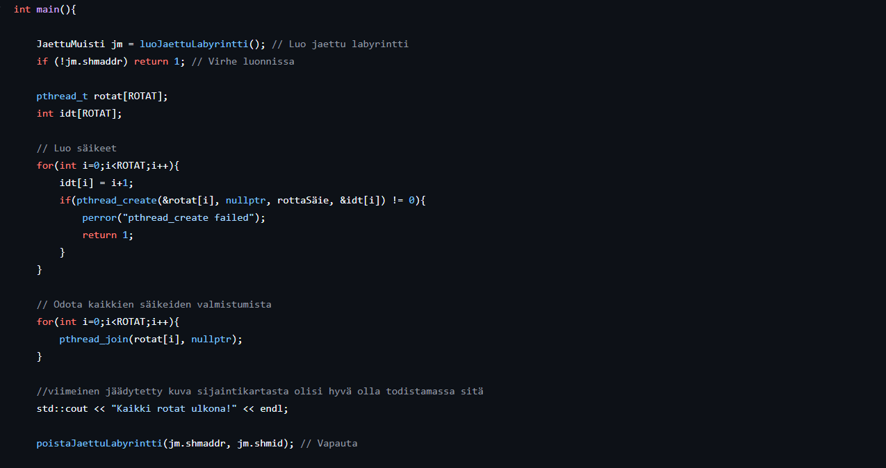
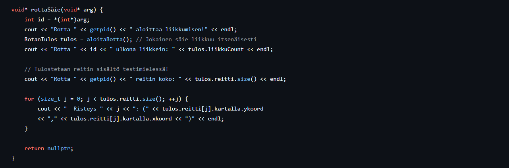

#### Tehtävä 3
Tavoite:
- Toteuta prosessien välinen jaettu muisti, joka sisältää labyrintin kokoisen sijaintikartan.
- Rotat (prosessit) merkitsevät oman sijaintinsa tähän karttaan.
- Kartta pysyy hallituissa olosuhteissa ajantasaisena.
- Kirjoitukseen käytetään eksplisiittistä eksklusiivisuutta.

Testattavat asiat:
- Prosessien välinen writer-synkronointi semaforin avulla.
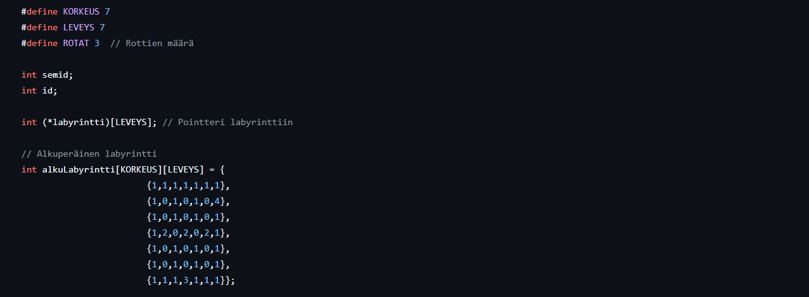
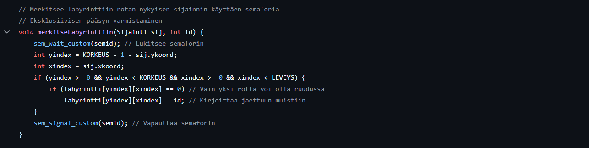
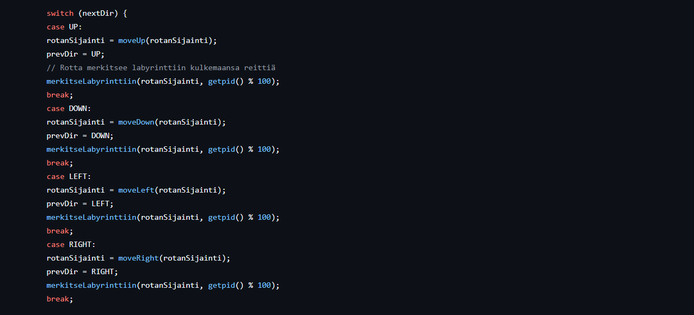
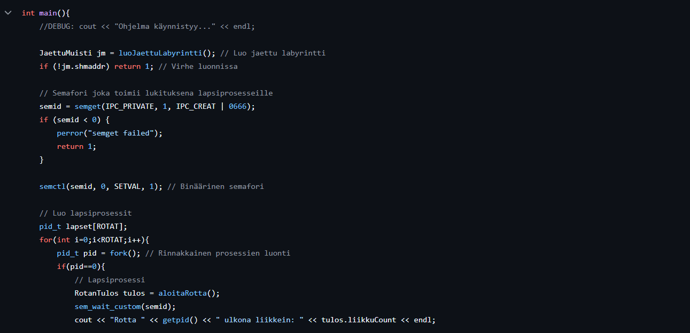
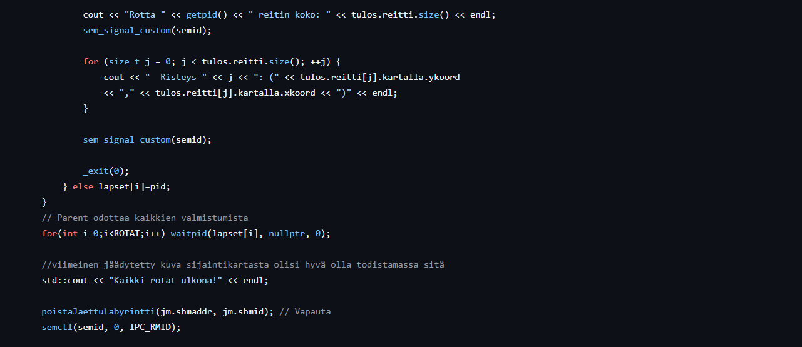

#### Tehtävä 4
Tavoite:
- Toteuta säikeiden välinen versio labyrintin kokoiselle sijaintikartalle.
- Kartta pysyy koko ajan ajantasaisena, kun rotat liikkuvat.
- Kirjoitukseen toteutetaan säikeiden välinen eksklusiivisuus.

Testattavat asiat:
- Säikeiden välinen eksklusiivinen pääsy.
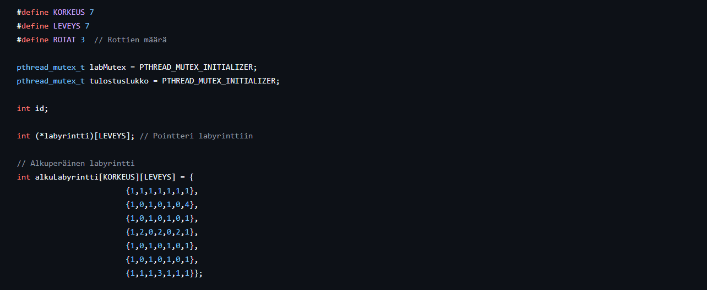
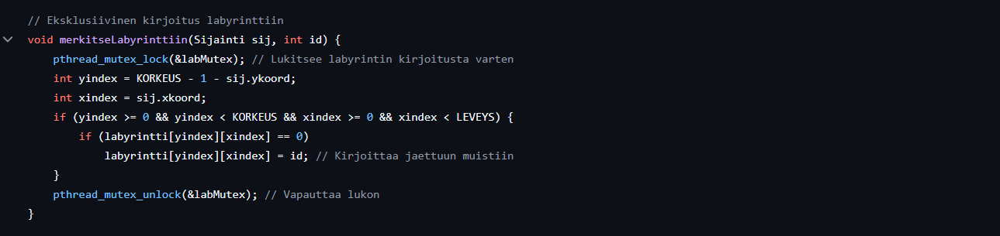
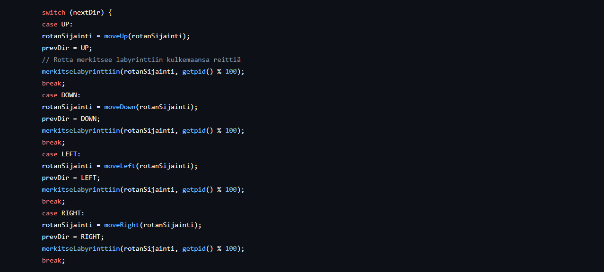
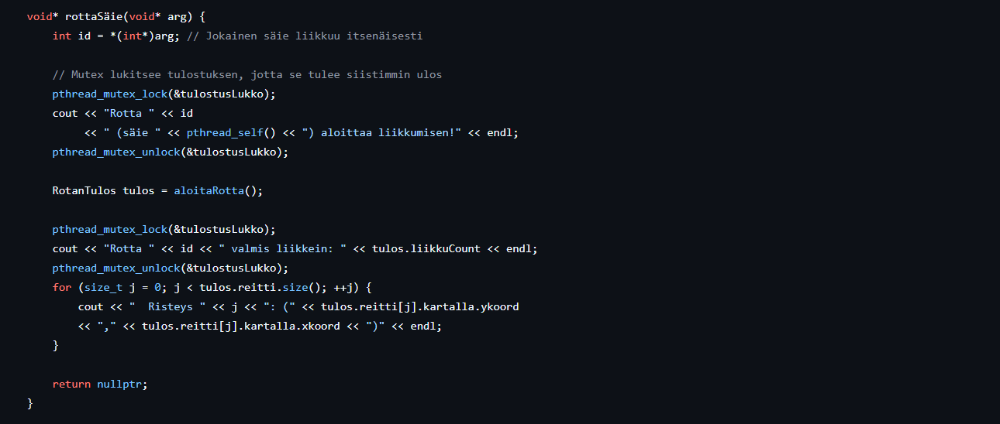
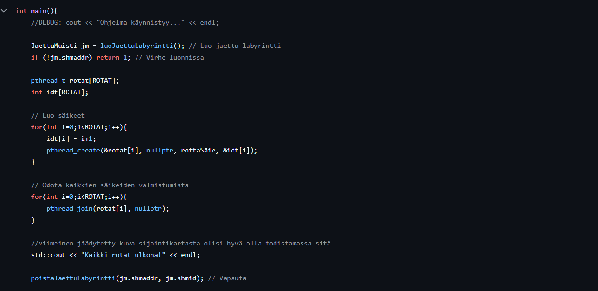

### SEURAAVA TASO (6p) 5-8

#### Tehtävä 5
Tavoite:
- Toteuta toimiva prosessien suspend-toiminnallisuus jäädytetyn labyrinttitilanteen talteenottamiseksi.
- Parent-prosessi jäädyttää kaikki lapsiprosessit määräajoin, tallentaa labyrintin sijaintikartan tiedostoon ja jatkaa prosessien suoritusta.
- Tallennus tehdään tekstimuotoon: jokaisen "valokuvan" jälkeen tyhjä rivi ja seuraava kartta sen alle.
- Toteutus hyödyntää prosessien hallintaa ja synkronointia (SIGSTOP, SIGCONT).

Testattavat asiat:
- Edistyneempi prosessien hallinta (pysäytys, jatkaminen, synkronointi).
- Kartan tallentuminen oikein ja loogisessa järjestyksessä.
- Prosessien jatkuminen samasta kohdasta pysäytyksen jälkeen.
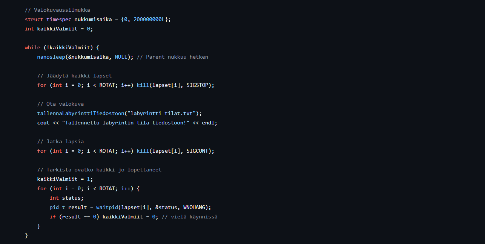
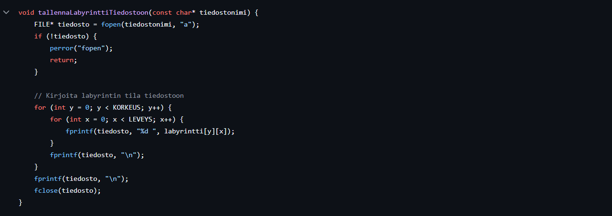

#### Tehtävä 6
Tavoite:
- Toteuta säikeiden suspend-toiminnallisuus ilman signaaleja.
- Pääsäie toimii ohjaavana säikeenä kuten prosessiesimerkissä.
- Säikeiden pysäytys ja jatkaminen tehdään säikeiden omilla synkronointikeinoilla (mutex ja condition_variable).

Testattavat asiat:
- Edistyneempi säikeiden hallinta ja säikeiden välinen synkronointi.
- mutex ja condition_variable käyttö oikein (ei deadlockeja).
- Karttatilanteen oikea tallentuminen pysäytyksen yhteydessä.
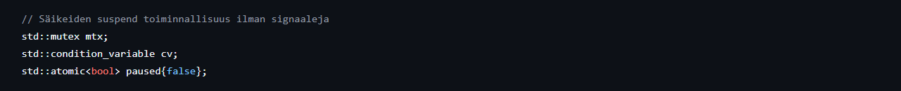

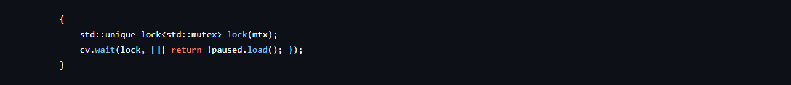
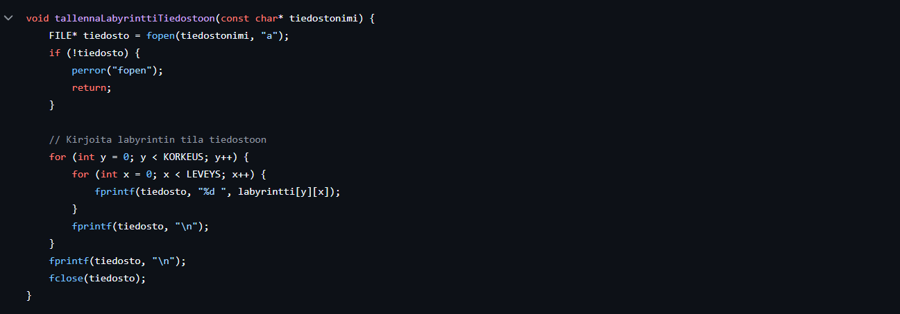
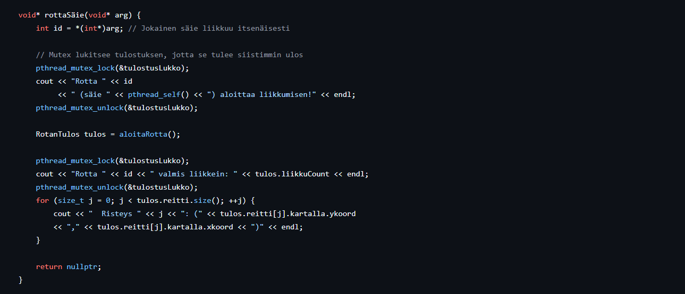
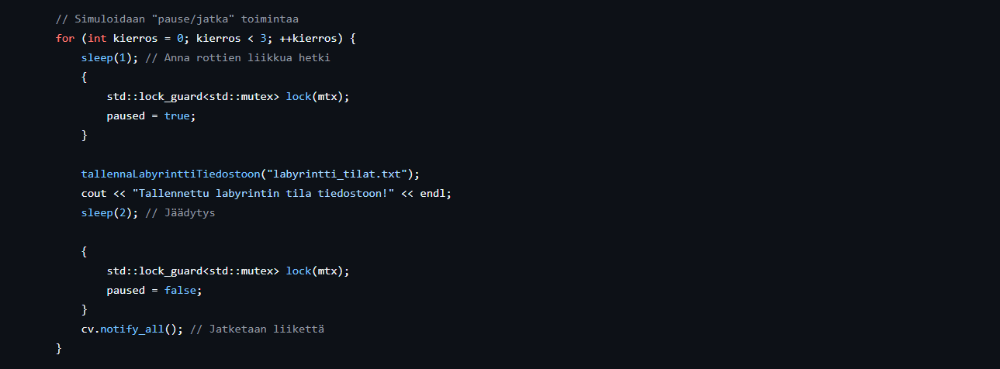

#### Tehtävä 7
Tavoite:
- Toteuta toimiva FIFO rajattu rengaspuskuri (bounded buffer) prosessien välille.
- Puskuri toimii jaetussa muistissa, ja sitä käytetään esim. viestien välittämiseen parent-prosessin ja lapsiprosessien välillä (producer–consumer-malli).
- Toteutus varmistaa synkronoidun ja rajatun pääsyn puskuriin.

Testattavat asiat:
- Rajatun puskurin käyttö prosessien välillä.
- Tuottaja–kuluttaja-synkronoinnin toimivuus (ei kilpajuoksua tai puskurin ylivuotoa).
- Jaetun muistin ja semaforien oikea käyttö.
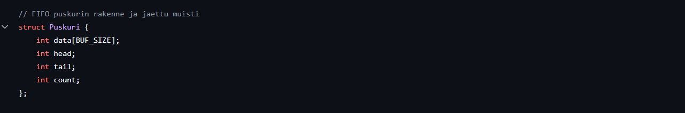

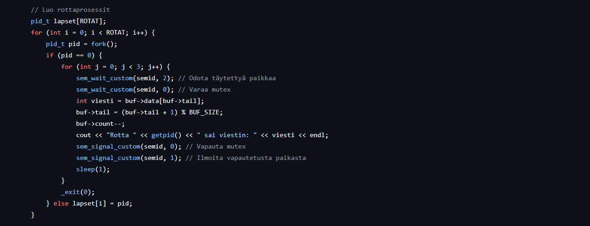
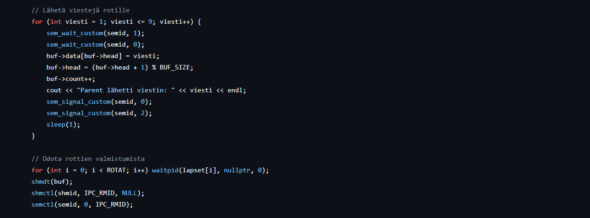

#### Tehtävä 8
Tavoite:
- Toteuta toimiva FIFO rajattu rengaspuskuri (bounded buffer) säikeiden välillä.
- Käytä säikeiden välisiä synkronointimekanismeja (mutex, condition_variable).
- Toteutus noudattaa tuottaja–kuluttaja-mallia säikeiden sisällä.

Testattavat asiat:
- Bounded buffer toteutuksen toiminta säikeiden välillä.
- Synkronoinnin toimivuus (mutex, condition_variable).
- Oikea viestinvälitys ilman kilpailutilanteita tai menetettyjä viestejä.
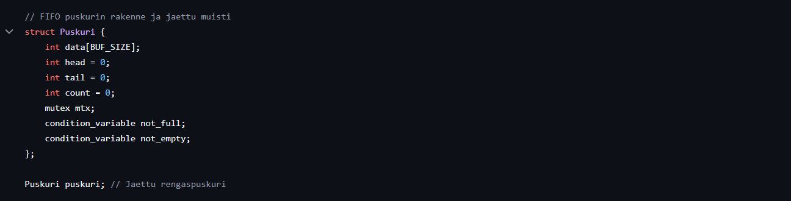
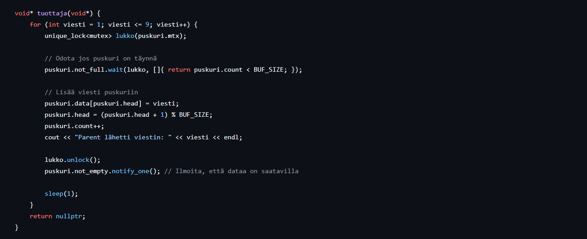
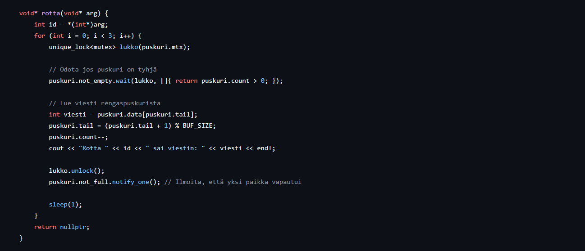
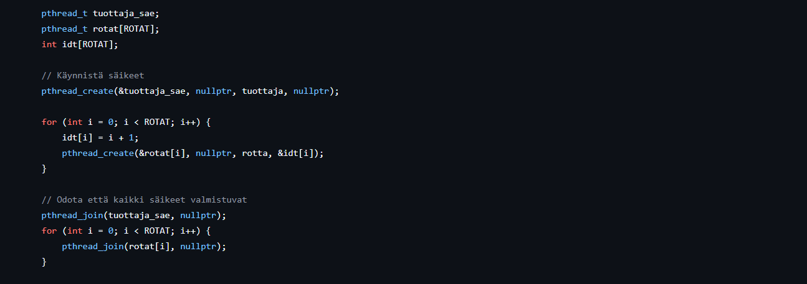